# Wire-Speed Tenant Isolation: Complete Technical Guide

> **A comprehensive guide to implementing ultra-low latency, hardware-enforced tenant isolation in modern AI and cloud infrastructure**

---

## Table of Contents

1. [Executive Summary](#executive-summary)
2. [Introduction to Wire-Speed Networking](#introduction-to-wire-speed-networking)
3. [The Multi-Tenant Challenge](#the-multi-tenant-challenge)
4. [Understanding DPUs, SmartNICs & IPUs](#understanding-dpus-smartnics--ipus)
5. [Vendor Landscape](#vendor-landscape)
6. [Architecture Deep Dive](#architecture-deep-dive)
7. [Layer 7 Offload & Security Implications](#layer-7-offload--security-implications)
8. [Implementation Patterns](#implementation-patterns)
9. [Use Cases](#use-cases)
10. [Security Attack Surfaces](#security-attack-surfaces)
11. [Advanced Security Topics](#advanced-security-topics)
12. [Performance Analysis](#performance-analysis)
13. [Deployment Topologies](#deployment-topologies)
14. [Best Practices](#best-practices)
15. [Future Directions](#future-directions)
16. [Appendix](#appendix)

---

## Executive Summary

### What is Wire-Speed Tenant Isolation?

Wire-speed tenant isolation is the capability to enforce complete separation between multiple tenants (customers, workloads, or security domains) on shared infrastructure **at full network line rate** — typically 100-400 Gbps — with **sub-10 microsecond latency** and **zero packet loss**.

### Why Does It Matter?

| Challenge | Traditional Approach | Wire-Speed Approach |
|-----------|---------------------|---------------------|
| Latency | 50-500μs (software) | <10μs (hardware) |
| Throughput | 10-40 Gbps | 100-400 Gbps |
| CPU Overhead | 30-60% cores for networking | <5% (offloaded) |
| Isolation Guarantee | Best-effort | Hardware-enforced |
| Cost per Gbps | High | Low |

### Key Statistics

- **$4.88M** — Average cost of a data breach (IBM 2024)
- **73%** — Attacks targeting application layer (Layer 7)
- **400 Gbps** — Current wire-speed target for AI infrastructure
- **667×** — AI traffic growth projected by 2027
- **<10μs** — Target E-W latency for distributed AI training

---

## Introduction to Wire-Speed Networking

### Defining "Wire Speed"

**Wire speed** means processing every packet at the maximum rate the physical medium supports, with zero queuing delay.


### The Physics Problem

At 400 Gbps, you have **1.68 nanoseconds** to:
1. Receive the packet
2. Parse headers (Ethernet, IP, TCP/UDP, application)
3. Look up tenant context
4. Apply security policies
5. Make routing decisions
6. Forward or drop

**Light travels only 50cm in 1.68 nanoseconds.** Software cannot achieve this — hardware acceleration is mandatory.

### Historical Evolution

| Era | Speed | Isolation Method | Latency |
|-----|-------|------------------|---------|
| 1990s | 10 Mbps | VLANs | 1-10ms |
| 2000s | 1 Gbps | VRFs, ACLs | 100μs-1ms |
| 2010s | 10-40 Gbps | SDN, vSwitches | 50-200μs |
| 2020s | 100-400 Gbps | DPU/SmartNIC | <10μs |
| 2025+ | 800 Gbps-1.6 Tbps | Integrated DPU | <5μs |

---

## The Multi-Tenant Challenge

### Why Multi-Tenancy is Hard

Multi-tenancy means multiple customers share the same physical infrastructure while maintaining complete isolation. This creates fundamental tensions:

```mermaid
graph TD
    I["🔒 ISOLATION"]
    P["⚡ PERFORMANCE"]
    C["💰 COST EFFICIENCY"]
    I --- P
    P --- C
    C --- I
    style I fill:#ff6b6b,color:#fff
    style P fill:#4ecdc4,color:#fff
    style C fill:#45b7d1,color:#fff
```



**The Fundamental Tension:**

You can optimize for any two of these properties, but the third will suffer:
- **High Isolation + High Performance** = Expensive (dedicated hardware per tenant)
- **High Isolation + Cost Efficient** = Slow (software-based isolation)
- **High Performance + Cost Efficient** = Weak isolation (shared resources)

Wire-speed tenant isolation with DPUs attempts to solve all three by moving isolation enforcement to dedicated hardware that operates at line rate.

### Isolation Requirements

#### 1. Data Plane Isolation
- No packet leakage between tenants
- No timing side-channels
- No shared buffer attacks

#### 2. Control Plane Isolation
- Independent routing tables
- Separate policy engines
- Isolated management interfaces

#### 3. Performance Isolation
- Guaranteed bandwidth
- Latency SLAs
- Fair queuing under contention

#### 4. Security Isolation
- Independent encryption keys
- Separate attestation chains
- Isolated failure domains

### The AI Infrastructure Challenge

AI workloads create unique multi-tenancy challenges:

| Characteristic | Impact on Isolation |
|---------------|---------------------|
| **Collective Operations** | All-reduce requires synchronized communication across thousands of GPUs |
| **Microbursts** | Traffic spikes of 100× average in <100μs |
| **Elephant Flows** | Single flows consuming 100+ Gbps for minutes |
| **Latency Sensitivity** | 1μs additional latency = measurable training slowdown |
| **East-West Dominance** | 80%+ traffic stays within datacenter |

```
AI Traffic Pattern Example (8,000 GPU cluster):

Normal state:     ████░░░░░░░░░░░░░░░░  20% utilization
Gradient sync:    ████████████████████  100% for 50ms
Idle:             ░░░░░░░░░░░░░░░░░░░░  0% for 200ms
Next sync:        ████████████████████  100% for 50ms

This bursty pattern breaks traditional QoS mechanisms.
```

---

## Understanding DPUs, SmartNICs & IPUs

### Terminology Clarification

| Term | Full Name | Primary Function | Key Vendor |
|------|-----------|------------------|------------|
| **SmartNIC** | Smart Network Interface Card | Accelerated networking | Mellanox, Intel, Broadcom |
| **DPU** | Data Processing Unit | Infrastructure offload | NVIDIA, AMD, Marvell |
| **IPU** | Infrastructure Processing Unit | Cloud infrastructure | Intel |
| **xPU** | Generic accelerator | Various | Multiple |

### Architecture Comparison


**Evolution of Network Offload:**

| Generation | Technology | CPU Load | Programmability | Use Case |
|------------|------------|----------|-----------------|----------|
| Gen 1 | Traditional NIC | 100% | None | Basic connectivity |
| Gen 2 | TOE/RDMA NIC | 70-80% | Fixed function | Storage, HPC |
| Gen 3 | SmartNIC | 30-50% | P4/eBPF | SDN, basic isolation |
| Gen 4 | DPU/IPU | <10% | Full stack | Multi-tenant cloud |

**Key Differentiator:** DPUs include general-purpose ARM cores running a full Linux environment, enabling complex control plane logic while hardware handles data plane at line rate.

### Key Capabilities Matrix

| Capability | Basic NIC | SmartNIC | DPU/IPU |
|-----------|-----------|----------|---------|
| Line-rate forwarding | ✗ | ✓ | ✓ |
| VXLAN/Geneve offload | ✗ | ✓ | ✓ |
| Stateful firewall | ✗ | Partial | ✓ |
| TLS termination | ✗ | ✗ | ✓ |
| Storage offload (NVMe-oF) | ✗ | ✗ | ✓ |
| Full OS on NIC | ✗ | ✗ | ✓ |
| Custom application hosting | ✗ | ✗ | ✓ |

---

## Vendor Landscape

### NVIDIA (BlueField DPU)

#### Product Line

| Model | Cores | Network | Accelerators | Use Case |
|-------|-------|---------|--------------|----------|
| **BlueField-2** | 8× A72 | 2×100G / 1×200G | Crypto, RegEx | Production standard |
| **BlueField-3** | 16× A78 | 2×200G / 1×400G | +DPA engines | AI infrastructure |
| **BlueField-4** | 16× Grace | 1×800G | +CXL, NVLink | Next-gen AI clouds |

#### Key Technologies

**DOCA SDK (Data Center Infrastructure on a Chip Architecture)**
```c
// Example: DOCA Flow API for tenant isolation
struct doca_flow_match match = {
    .outer = {
        .l3_type = DOCA_FLOW_L3_TYPE_IP4,
        .src_ip = tenant_a_subnet,
    },
};

struct doca_flow_actions actions = {
    .decap = true,
    .mod_dst_mac = tenant_a_gateway_mac,
};

// Hardware-enforced at 400Gbps line rate
doca_flow_pipe_add_entry(pipe, &match, &actions, NULL);
```

**NVIDIA ASTRA (Advanced Secure Trusted Resource Architecture)**
- Hardware root of trust
- Secure boot chain
- Runtime attestation
- Encrypted memory regions

#### Pricing (Approximate)

| Model | List Price | Volume Price |
|-------|-----------|--------------|
| BlueField-2 100G | $2,000-3,000 | $1,500-2,000 |
| BlueField-3 200G | $4,000-6,000 | $3,000-4,500 |
| BlueField-3 400G | $8,000-12,000 | $6,000-9,000 |

---

### Intel (IPU)

#### Product Line

| Model | Architecture | Network | Target |
|-------|-------------|---------|--------|
| **Mount Evans (E2000)** | ARM + FPGA | 2×100G | Cloud providers |
| **Oak Springs Canyon** | Xeon-D + FPGA | 2×100G | Enterprise |
| **Hotrock** | Custom ASIC | 400G | Hyperscalers |

#### Key Technologies

**IPDK (Infrastructure Programmer Development Kit)**
```p4
// P4 program for tenant isolation on Intel IPU
control TenantIsolation(inout headers_t hdr,
                        inout metadata_t meta) {
    table tenant_lookup {
        key = {
            hdr.vxlan.vni : exact;
        }
        actions = {
            set_tenant_context;
            drop;
        }
        size = 64000;  // 64K tenants
    }
    
    apply {
        tenant_lookup.apply();
    }
}
```

**Intel TDX Integration**
- Trusted Domain Extensions for confidential computing
- IPU acts as trusted intermediary
- Memory encryption keys managed by IPU

---

### AMD (Pensando DPU)

#### Product Line

| Model | Cores | Network | Differentiator |
|-------|-------|---------|----------------|
| **DSC-25** | 16× P4 cores | 2×25G | Entry-level |
| **DSC-100** | 16× P4 cores | 2×100G | Mainstream |
| **DSC-200** | 16× P4 cores | 2×200G | High performance |

#### Key Technologies

**P4-Native Architecture**
- Entire data plane programmable in P4
- No fixed-function limitations
- True wire-speed programmability

**Pensando Policy and Services Manager (PSM)**
- Centralized policy management
- Multi-tenant orchestration
- API-driven automation

---

### Marvell (OCTEON & Prestera)

#### Product Line

| Family | Type | Target Market |
|--------|------|---------------|
| **OCTEON 10** | DPU | Cloud & Enterprise |
| **Prestera** | Switch ASIC | Network switches |
| **ARMADA** | SoC | Edge computing |

#### Key Features
- Inline MACsec at 400G
- Hardware RegEx for DPI
- Native ARM ecosystem

---

### Broadcom (Memory)

#### Product Line

| Model | Type | Capability |
|-------|------|------------|
| **Memory 220P** | SmartNIC | 2×25G, limited offload |
| **Stingray** | DPU | 2×100G, full offload |
| **Thor** | Next-gen | 400G, CXL support |

---

### Fungible (Now Microsoft)

Microsoft acquired Fungible in 2023 for its DPU technology.

#### Key Innovation
- **Fungible Data Center** — Composable infrastructure
- **TrueFabric** — Lossless Ethernet at scale
- Now integrated into Azure infrastructure

---

### Vendor Comparison Matrix

| Vendor | Max Speed | ARM Cores | P4 Support | Market Position |
|--------|-----------|-----------|------------|-----------------|
| NVIDIA | 400G (800G soon) | 16 | DOCA Flow | AI Leader |
| Intel | 200G (400G soon) | 8-16 | Native P4 | Cloud Provider Focus |
| AMD | 200G | 16 P4 | Native P4 | Programmability |
| Marvell | 400G | 24 | Limited | Networking Focus |
| Broadcom | 100G | 8 | Limited | Cost-Optimized |

---

## Architecture Deep Dive

### Reference Architecture


### Packet Flow (Wire-Speed Path)


**Total Pipeline Latency: ~500ns**

This is well under the 1.68ns budget per packet because of parallel pipeline processing - multiple packets are processed simultaneously at different stages.

### Memory Architecture

```mermaid
flowchart TB
    subgraph MEM["DPU Memory Hierarchy"]
        SRAM["🟢 On-Chip SRAM<br/>50-100 MB | ~5ns"]
        HBM["🔵 HBM / GDDR<br/>8-32 GB | ~100ns"]
        DDR["🟣 DDR4/DDR5<br/>16-64 GB | ~50-100ns"]
        HOSTMEM["🔴 Host Memory DMA<br/>~500ns-1μs"]
    end
    SRAM --> HBM --> DDR --> HOSTMEM
    style SRAM fill:#27ae60,color:#fff
    style HBM fill:#3498db,color:#fff
    style DDR fill:#9b59b6,color:#fff
    style HOSTMEM fill:#e74c3c,color:#fff
```



**Memory Tier Usage:**
| Tier | Contents | Access Pattern |
|------|----------|----------------|
| SRAM | Active flow tables, packet buffers | Every packet |
| HBM/GDDR | Extended tables, statistics | Frequent lookups |
| DDR | ARM subsystem, Linux kernel | Control plane |
| Host Memory | Large packet queues, DMA buffers | Bulk transfers |

**Design Principle:** Keep hot data (flow tables, counters) in SRAM for single-digit nanosecond access. Spill to HBM only when SRAM capacity is exceeded.

---

## Layer 7 Offload & Security Implications

### What Gets Offloaded to Layer 7

| Function | Layer | Complexity | Security Risk |
|----------|-------|------------|---------------|
| Switching | L2 | Low | Low |
| Routing | L3 | Medium | Low |
| Firewalling | L3-4 | Medium | Medium |
| Load Balancing | L4-7 | High | Medium |
| TLS Termination | L4-7 | High | High |
| API Gateway | L7 | Very High | Very High |
| WAF | L7 | Very High | Very High |
| Deep Packet Inspection | L7 | Very High | Very High |

### The Security Trade-off

```mermaid
flowchart LR
    subgraph LOW["Lower Risk"]
        L23["L2-L3 Offload<br/>• Switching<br/>• Routing<br/>• Basic ACL"]
    end
    subgraph HIGH["Higher Risk"]
        L47["L4-L7 Offload<br/>• TLS<br/>• WAF<br/>• DPI"]
    end
    LOW -->|"More Offload →"| HIGH
    HIGH -->|"More Attack Surface"| RISK["⚠️"]
    style LOW fill:#27ae60,color:#fff
    style HIGH fill:#e74c3c,color:#fff
```



**Risk Assessment by Layer:**

| Offload Type | Attack Surface | Vulnerability Impact | Recommendation |
|--------------|----------------|---------------------|----------------|
| L2 Switching | Minimal | MAC spoofing, VLAN hopping | Safe to offload |
| L3 Routing | Low | Route injection | Safe with validation |
| L4 Firewall | Medium | State table exhaustion | Offload with monitoring |
| TLS Termination | High | Key exposure, protocol bugs | Careful evaluation |
| WAF/DPI | Very High | Regex DoS, parser exploits | Consider hybrid approach |

**Recommendation:** Start with L2-L4 offload where the security/performance tradeoff is favorable. Evaluate L7 offload on a case-by-case basis.

### Attack Surface Expansion

When you move logic to Layer 7 in hardware, you create:

1. **Shared Memory Attack Surface**
   - Host ↔ DPU shared buffers
   - Potential for buffer overflows
   - Type confusion vulnerabilities

2. **Complex Parsing Attack Surface**
   - HTTP/2, gRPC, TLS parsers
   - Protocol state machines
   - Malformed input handling

3. **Trust Boundary Attack Surface**
   - PCIe interface
   - DMA mappings
   - Attestation chain

4. **Visibility Blind Spots**
   - Traffic processed entirely on DPU
   - SOC tools may not see it
   - Logging limitations

---

## Implementation Patterns

### Pattern 1: Bump-in-the-Wire (Transparent)


**Characteristics:**
- DPU acts as transparent bridge
- No IP address on DPU  
- Minimal configuration
- Limited functionality

**Use Case:** Simple traffic inspection, basic isolation

**Use Case:** Simple traffic inspection, basic isolation

---

### Pattern 2: Gateway Mode


**Characteristics:**
- DPU has IP addresses
- Full L3 routing
- NAT, firewalling
- Complete isolation

**Use Case:** Multi-tenant cloud, VPC implementation

**Use Case:** Multi-tenant cloud, VPC implementation

---

### Pattern 3: Sidecar Mode

```mermaid
flowchart LR
    subgraph SERVER["Server"]
        APP["Application"] -->|localhost| DPU["DPU Sidecar"]
    end
    NET["🌐 Network"] <--> DPU
    style DPU fill:#e74c3c,color:#fff
    style APP fill:#3498db,color:#fff
```



**Characteristics:**
- DPU handles all external traffic
- Application only sees localhost
- Full security enforcement
- Zero application changes

**Use Case:** Legacy application modernization, service mesh

**Use Case:** Legacy application modernization, service mesh

---

### Pattern 4: Hypervisor Integration


**Characteristics:**
- SR-IOV for direct VM access
- Hardware eSwitch for isolation
- OVS for control plane only
- Maximum performance

**Use Case:** Cloud infrastructure, OpenStack/Kubernetes

**Use Case:** Cloud infrastructure, OpenStack/Kubernetes

---

### Pattern 5: Distributed Services Mesh


**Characteristics:**
- DPU per node
- Distributed policy enforcement
- Mesh encryption (mTLS)
- Kubernetes CNI integration

**Use Case:** Cloud-native applications, microservices

**Use Case:** Cloud-native applications, microservices

---

## Use Cases

### Use Case 1: Multi-Tenant AI Cloud

**Scenario:** Cloud provider offering GPU-as-a-Service with strict tenant isolation

**Requirements:**
- 10,000+ tenants per region
- 400 Gbps per GPU server
- <10μs E-W latency
- Zero cross-tenant data leakage
- Per-tenant bandwidth guarantees

**Architecture:**


**AI/GPU Cloud Isolation Requirements:**

| Requirement | Implementation | Why It Matters |
|-------------|----------------|----------------|
| GPU Memory Isolation | MIG (Multi-Instance GPU) | Prevent cross-tenant GPU memory access |
| Network Bandwidth | Per-tenant rate limiting | Guarantee training job network SLAs |
| NVLink Isolation | Hardware partitioning | Prevent inter-GPU side channels |
| Storage I/O | Separate NVMe namespaces | Checkpoint/restore isolation |

**Key Challenge:** AI training workloads generate sustained 400 Gbps traffic for extended periods. Traditional burst-based traffic engineering assumptions don't apply.

**Implementation:**
```python
# DOCA Flow configuration for AI tenant isolation
def configure_ai_tenant(tenant_id, vni, bandwidth_gbps, gpu_ids):
    # Create tenant context
    tenant_ctx = doca_flow_create_tenant_context(
        vni=vni,
        bandwidth=bandwidth_gbps * 1e9,
        priority=DOCA_FLOW_PRIORITY_HIGH
    )
    
    # Configure GPU-to-GPU flows (intra-tenant)
    for src_gpu in gpu_ids:
        for dst_gpu in gpu_ids:
            if src_gpu != dst_gpu:
                doca_flow_add_gpu_flow(
                    tenant_ctx,
                    src_gpu=src_gpu,
                    dst_gpu=dst_gpu,
                    action=ALLOW,
                    rdma=True  # Enable GPUDirect RDMA
                )
    
    # Block cross-tenant GPU communication
    doca_flow_add_default_rule(
        tenant_ctx,
        action=DROP,
        log=True
    )
    
    # Enable telemetry
    doca_telemetry_enable(
        tenant_ctx,
        metrics=['bandwidth', 'latency', 'drops'],
        interval_ms=100
    )
    
    return tenant_ctx
```

---

### Use Case 2: Financial Services Trading Infrastructure

**Scenario:** Ultra-low latency trading platform with regulatory isolation requirements

**Requirements:**
- <5μs network latency
- Nanosecond-precision timestamping
- Complete audit trail
- MiFID II / Reg NMS compliance
- Deterministic performance

**Architecture:**


```mermaid
flowchart TB
    subgraph TRADE["Trading Server"]
        subgraph APP["Trading App"]
            STRAT["Strategy"]
            ORD["Orders"]
            MKT["Market Data"]
        end
        subgraph DPU["BlueField DPU"]
            TS["⏱️ HW Timestamp"]
            CA["Client A Flow"]
            CB["Client B Flow"]
            COMP["✅ Compliance"]
        end
    end
    APP -->|"DPDK"| DPU
    style APP fill:#3498db,color:#fff
    style DPU fill:#27ae60,color:#fff
```

**Financial Services Requirements:**

| Feature | Specification | Regulatory Driver |
|---------|---------------|-------------------|
| Timestamping | PTP, <100ns accuracy | MiFID II, CAT |
| Order Isolation | Per-client flow queues | Best execution |
| Pre-trade Risk | Hardware rate checks | Risk management |
| Audit Trail | Every packet logged | SEC Rule 17a-4 |

**Latency Budget (Market Data to Order):**
- Wire to DPU: 100ns
- DPU parsing: 50ns
- Risk check: 200ns
- Order formatting: 100ns
- DPU to wire: 100ns
- **Total: ~550ns** (sub-microsecond)

**Key Features:**
- Hardware PTP for nanosecond timestamps
- Kernel bypass for minimum latency
- Hardware-enforced pre-trade risk checks
- Complete order audit trail
- Client flow isolation

---

### Use Case 3: Telecommunications 5G Core

**Scenario:** 5G User Plane Function (UPF) with subscriber isolation

**Requirements:**
- 100Gbps per UPF instance
- 1M+ subscribers per node
- 3GPP compliance
- Network slicing support
- <1ms user plane latency

**Architecture:**


```mermaid
flowchart TB
    subgraph UPF["5G UPF Server"]
        subgraph UPFAPP["UPF App"]
            SMF["SMF"]
            AMF["AMF"]
            PCF["PCF"]
        end
        subgraph DPU["BlueField DPU"]
            S1["eMBB 100G"]
            S2["URLLC <1ms"]
            S3["mMTC 1M"]
            GTP["GTP-U"]
        end
    end
    UPFAPP --> DPU
    N3["📡 N3"] <--> DPU
    DPU <--> N6["🌐 N6"]
    style UPFAPP fill:#3498db,color:#fff
    style DPU fill:#27ae60,color:#fff
```

**5G Network Slice Characteristics:**

| Slice Type | Bandwidth | Latency | Density | Use Case |
|------------|-----------|---------|---------|----------|
| eMBB | 100+ Gbps | 10ms | Medium | Video streaming, downloads |
| URLLC | 10 Mbps | <1ms | Low | Autonomous vehicles, remote surgery |
| mMTC | 1 Mbps | Relaxed | 1M/km² | IoT sensors, smart meters |

**DPU Offload Benefits:**
- GTP-U encap/decap at 100+ Gbps line rate
- Per-subscriber QoS enforcement in hardware
- Usage metering without CPU overhead
- Slice isolation with zero cross-talk

---

### Use Case 4: Healthcare Data Platform

**Scenario:** Multi-tenant healthcare analytics with HIPAA compliance

**Requirements:**
- PHI isolation (HIPAA)
- Encryption at rest and in transit
- Complete audit logging
- Data residency controls
- Breach detection

**Security Controls:**


```mermaid
flowchart TB
    subgraph HEALTH["Healthcare Platform"]
        subgraph HOSP["Hospitals"]
            HA["Hospital A"]
            HB["Hospital B"]
            HC["Hospital C"]
        end
        subgraph DPUL["DPU Layer"]
            ENC["🔐 Encryption"]
            ACC["🔑 Access Control"]
            AUD["📋 Audit"]
        end
    end
    HA --> DPUL
    HB --> DPUL
    HC --> DPUL
    style HOSP fill:#e74c3c,color:#fff
    style DPUL fill:#27ae60,color:#fff
```

**Healthcare Compliance Requirements:**

| Regulation | Requirement | DPU Implementation |
|------------|-------------|-------------------|
| HIPAA | PHI encryption in transit | MACsec + IPsec at line rate |
| HIPAA | Access controls | Hardware-enforced RBAC |
| HIPAA | Audit trails | Per-packet logging |
| HITECH | Breach notification | Real-time anomaly detection |
| GDPR | Data residency | Geo-fencing in hardware |

**Security Controls:**
- **Encryption:** AES-256-GCM with per-tenant keys, HSM integration for key management
- **Access Control:** Role-based policies, time-based access windows, geographic restrictions
- **Audit:** Every packet logged with tamper-proof storage, real-time SIEM feed for compliance

---

### Use Case 5: Gaming Infrastructure

**Scenario:** Cloud gaming platform with latency-critical multi-tenancy

**Requirements:**
- <20ms total latency (network + processing)
- 60fps video streaming
- Fair resource allocation
- Anti-cheat integration
- Regional failover

---

## Security Attack Surfaces

### Attack Surface Map

```mermaid
flowchart TB
    subgraph ATTACKS["Attack Surface"]
        HOST["🖥️ HOST<br/>PCIe, DMA, Drivers"]
        DPUSIDE["🔧 DPU<br/>Firmware, ARM OS"]
        NETSIDE["🌐 NETWORK<br/>Physical, MITM"]
    end
    subgraph CROSS["⚠️ CROSS-CUTTING"]
        C1["Side channels<br/>Supply chain<br/>Tenant escape"]
    end
    HOST --> CROSS
    DPUSIDE --> CROSS
    NETSIDE --> CROSS
    style HOST fill:#e74c3c,color:#fff
    style DPUSIDE fill:#f39c12,color:#fff
    style NETSIDE fill:#9b59b6,color:#fff
    style CROSS fill:#2c3e50,color:#fff
```



**Detailed Attack Vectors:**

| Surface | Attack Vector | Impact | Mitigation |
|---------|---------------|--------|------------|
| **Host Side** | PCIe BAR manipulation | Memory access | IOMMU strict mode |
| | DMA attacks | Data exfiltration | ATS validation |
| | Driver vulnerabilities | Privilege escalation | Signed drivers |
| **DPU Side** | Firmware tampering | Persistent compromise | Secure boot, attestation |
| | ARM OS exploits | Control plane takeover | Minimal attack surface |
| | Accelerator bugs | Data corruption | Input validation |
| **Network** | Physical tap | Traffic interception | MACsec encryption |
| | MITM attacks | Data manipulation | Certificate pinning |
| | Replay attacks | Session hijacking | Sequence numbers, timestamps |
| **Cross-Cutting** | Timing side-channels | Information leakage | Constant-time operations |
| | Supply chain | Backdoors | Vendor audits, attestation |
| | Tenant escape | Full compromise | Defense in depth |

### Attack Vector Details

#### 1. DMA Attacks

**Description:** Direct Memory Access allows DPU to read/write host memory without CPU involvement.

**Attack Scenarios:**
- Pre-boot credential theft
- Kernel memory manipulation
- Encryption key extraction
- Code injection

**Mitigations:**
```
IOMMU Configuration:

# Enable IOMMU in strict mode
GRUB_CMDLINE_LINUX="intel_iommu=on iommu=strict"

# Or for AMD
GRUB_CMDLINE_LINUX="amd_iommu=on iommu=strict"

# Verify IOMMU groups
for d in /sys/kernel/iommu_groups/*/devices/*; do
    n=$(basename $(dirname $(dirname $d)))
    echo "IOMMU Group $n: $(lspci -nns ${d##*/})"
done
```

---

#### 2. Shared Memory Attacks

**Description:** Buffer overflows or type confusion in host-DPU shared memory regions.

**Example Vulnerability:**
```c
// Vulnerable code pattern
struct shared_buffer {
    uint32_t length;     // Attacker controlled
    uint8_t data[];      // Variable length
};

void process_packet(struct shared_buffer *buf) {
    // BUG: No bounds check against actual buffer size
    char local[256];
    memcpy(local, buf->data, buf->length);  // Overflow!
}
```

**Secure Pattern:**
```c
// Secure code pattern
void process_packet(struct shared_buffer *buf, size_t buf_size) {
    // Validate length against actual buffer
    if (buf->length > buf_size - sizeof(uint32_t)) {
        log_security_event("Buffer overflow attempt");
        return;
    }
    
    // Additional sanity check
    if (buf->length > MAX_PACKET_SIZE) {
        log_security_event("Invalid packet size");
        return;
    }
    
    char local[MAX_PACKET_SIZE];
    memcpy(local, buf->data, buf->length);
}
```

---

#### 3. Firmware Attacks

**Description:** Compromising DPU firmware to gain persistent access.

**Attack Chain:**

```mermaid
flowchart TB
    A1["1️⃣ Supply Chain"] --> A1a["Malicious firmware in manufacturing"]
    A2["2️⃣ Update Server"] --> A2a["MITM on firmware update"]
    A3["3️⃣ Local Exploit"] --> A3a["ARM Linux vuln → Flash modified FW"]
    A4["4️⃣ Physical Access"] --> A4a["JTAG/debug → Flash extraction"]
    style A1 fill:#e74c3c,color:#fff
    style A2 fill:#f39c12,color:#fff
    style A3 fill:#9b59b6,color:#fff
    style A4 fill:#2c3e50,color:#fff
```


**Mitigations:**
- Secure boot with hardware root of trust
- Signed firmware updates
- Runtime attestation
- Disable debug interfaces in production

---

#### 4. Side-Channel Attacks

**Description:** Extracting secrets through timing, power, or electromagnetic analysis.

**Timing Attack Example:**
```python
# Detecting tenant activity through timing
import time

def measure_dpu_response_time(packet):
    start = time.perf_counter_ns()
    send_packet(packet)
    wait_for_response()
    end = time.perf_counter_ns()
    return end - start

# Collect timing samples
timings = []
for i in range(10000):
    t = measure_dpu_response_time(probe_packet)
    timings.append(t)

# Analyze timing distribution
# Bimodal distribution may indicate cache hit/miss
# revealing information about other tenants
analyze_timing_distribution(timings)
```

**Mitigations:**
- Constant-time operations for sensitive paths
- Cache partitioning between tenants
- Noise injection
- Rate limiting per tenant

---

#### 5. Tenant Escape

**Description:** Breaking out of tenant isolation to access other tenants' data.

**Escape Vectors:**
1. **VNI Spoofing:** Crafting packets with other tenants' VXLAN Network Identifiers
2. **Flow Table Poisoning:** Manipulating shared flow tables
3. **Resource Exhaustion:** DoS against shared resources to cause fallback to insecure path
4. **Metadata Leakage:** Extracting tenant info from error messages or timing

---

## Advanced Security Topics

### DMA & IOMMU Deep Dive


**IOMMU Page Table Structure:**

| Level | Entry | Contents |
|-------|-------|----------|
| Root Table | Entry 0 | Context Table (DPU) |
| Context Table | Domain 0 | Tenant A pages |
| Context Table | Domain 1 | Tenant B pages |
| Context Table | Domain 2 | Shared pages |

**Why IOMMU Matters:**
Without IOMMU protection, a compromised DPU could read or write any location in host memory, potentially accessing other tenants' data or injecting malicious code. IOMMU provides hardware-enforced memory isolation that cannot be bypassed by software.

### eBPF/XDP Security

**eBPF (Extended Berkeley Packet Filter)** allows running sandboxed programs in the kernel. **XDP (eXpress Data Path)** runs eBPF at the NIC driver level for wire-speed processing.

**Security Risks:**
```c
// Example: eBPF verifier bypass (historical CVE pattern)
SEC("xdp")
int exploit(struct xdp_md *ctx) {
    void *data = (void *)(long)ctx->data;
    void *data_end = (void *)(long)ctx->data_end;
    
    // Verifier tracks bounds...
    if (data + 100 > data_end)
        return XDP_DROP;
    
    // But complex control flow can confuse it
    int offset = some_complex_calculation();
    
    // Verifier may not catch this OOB access
    char *ptr = data + offset;  // Could be out of bounds!
    char leak = *ptr;           // Information leak
    
    return XDP_PASS;
}
```

**Mitigations:**
- Keep kernel updated (verifier improvements)
- Limit eBPF to privileged users
- Use eBPF LSM for additional checks
- Audit all loaded eBPF programs

### Multi-Tenant Side-Channel Analysis


**Attack Mechanism Explained:**
1. Tenant A fills specific cache lines with known data
2. Tenant B's workload evicts some of A's cached data
3. Tenant A measures access latency to its original data
4. Slow access indicates cache miss = B accessed that memory region
5. By repeating this process, A can reconstruct B's access patterns

**Mitigations:**
- Cache partitioning (Intel CAT, AMD QoS)
- Time-constant operations for security-critical code
- Cache line flushing between tenant context switches
- Statistical noise injection

**Defense: Cache Partitioning**
```mermaid
flowchart LR
    subgraph CACHE["L3 Cache 30 MB"]
        TA["Tenant A<br/>8 MB<br/>Ways 0-3"]
        TB["Tenant B<br/>8 MB<br/>Ways 4-7"]
        TC["Tenant C<br/>8 MB<br/>Ways 8-11"]
        SH["Shared<br/>6 MB<br/>Ways 12-14"]
    end
    style TA fill:#e74c3c,color:#fff
    style TB fill:#27ae60,color:#fff
    style TC fill:#3498db,color:#fff
    style SH fill:#9b59b6,color:#fff
```

```bash
# Allocate cache ways
pqos -e "llc:0=0x000F"   # Tenant A: ways 0-3
pqos -e "llc:1=0x00F0"   # Tenant B: ways 4-7
pqos -e "llc:2=0x0F00"   # Tenant C: ways 8-11
# Assign tenants
pqos -a "core:0-7=0"     # Tenant A cores
pqos -a "core:8-15=1"    # Tenant B cores
```

---

## Performance Analysis

### Latency Breakdown

```mermaid
pie title Latency Budget 10μs Total
    "App Processing 2.0μs" : 2.0
    "Host OS 0.5μs" : 0.5
    "PCIe 0.3μs" : 0.3
    "DPU 1.5μs" : 1.5
    "Wire 0.5μs" : 0.5
    "Switch x2 1.0μs" : 1.0
    "Remote DPU 1.5μs" : 1.5
    "Remote Host 2.7μs" : 2.7
```

**DPU Processing Breakdown (1.5μs total):**
- Parser: 0.2μs
- Tenant lookup: 0.1μs
- Policy engine: 0.5μs
- Header modification: 0.2μs
- Queue management: 0.5μs

This latency budget assumes optimized configurations with hardware offload enabled.

### Throughput Analysis

```mermaid
flowchart LR
    T1["Theoretical<br/>400 Gbps"] --> T2["FEC<br/>390.6<br/>-2.3%"]
    T2 --> T3["Gaps<br/>381<br/>-4.8%"]
    T3 --> T4["VXLAN<br/>357<br/>-10.8%"]
    T4 --> T5["Encrypt<br/>340<br/>-15%"]
    T5 --> T6["Actual<br/>320<br/>-20%"]
    style T1 fill:#27ae60,color:#fff
    style T6 fill:#e74c3c,color:#fff
```

**Packets Per Second (64-byte minimum packets):**
- Theoretical maximum: 595.2 Mpps
- With encapsulation overhead: 476.2 Mpps
- Practical sustainable limit: 400.0 Mpps

The gap between theoretical and practical throughput accounts for real-world factors including inter-packet gaps, flow table lookups, and policy enforcement overhead.

### Benchmark Results

| Vendor | Model | Throughput | Latency (p99) | Tenants |
|--------|-------|------------|---------------|---------|
| NVIDIA | BF-3 400G | 380 Gbps | 3.2 μs | 64K |
| Intel | IPU E2100 | 190 Gbps | 4.1 μs | 32K |
| AMD | DSC-200 | 190 Gbps | 3.8 μs | 16K |
| Marvell | OCTEON 10 | 380 Gbps | 4.5 μs | 48K |

---

## Deployment Topologies

### Topology 1: Spine-Leaf (Standard)

```mermaid
flowchart TB
    subgraph SPINE["Spine Layer"]
        S1["Spine 1<br/>400G"]
        S2["Spine 2<br/>400G"]
    end
    subgraph LEAF["Leaf Layer"]
        L1["Leaf 1"]
        L2["Leaf 2"]
        L3["Leaf 3"]
        L4["Leaf 4"]
    end
    subgraph SERVERS["Server Layer"]
        SV1["Server+DPU"]
        SV2["Server+DPU"]
        SV3["Server+DPU"]
        SV4["Server+DPU"]
    end
    S1 --> L1
    S1 --> L2
    S1 --> L3
    S1 --> L4
    S2 --> L1
    S2 --> L2
    S2 --> L3
    S2 --> L4
    L1 --> SV1
    L2 --> SV2
    L3 --> SV3
    L4 --> SV4
    style SPINE fill:#e74c3c,color:#fff
    style LEAF fill:#3498db,color:#fff
    style SERVERS fill:#27ae60,color:#fff
```

**Characteristics:**
- 2 hops maximum (any server to any server)
- Predictable latency
- Easy to scale horizontally
- Non-blocking with proper oversubscription

**Best For:** General-purpose data center workloads

### Topology 2: Rail-Optimized (AI Training)

```mermaid
flowchart TB
    subgraph RAILS["Rail Switches"]
        R0["Rail 0"]
        R1["Rail 1"]
        R2["Rail 2"]
    end
    subgraph SV["Server"]
        G0["GPU 0"]
        G1["GPU 1"]
        G2["GPU 2"]
        G3["GPU 3"]
        DPU["DPU"]
    end
    R0 --> G0
    R0 --> G3
    R1 --> G1
    R2 --> G2
    style R0 fill:#e74c3c,color:#fff
    style R1 fill:#27ae60,color:#fff
    style R2 fill:#3498db,color:#fff
    style SV fill:#2c3e50,color:#fff
```

**Characteristics:**
- Optimized for all-reduce operations
- Each GPU connects to dedicated rail switch
- Minimizes cross-rail traffic
- Ideal for large-scale training

**Best For:** AI/ML training clusters with heavy collective operations

### Topology 3: Dragonfly+ (Hyperscale)

```mermaid
flowchart TB
    subgraph G0["Group 0"]
        S00["S0"] --- S01["S1"] --- S02["S2"]
        SRV0["Servers"]
    end
    subgraph G1["Group 1"]
        S10["S0"] --- S11["S1"] --- S12["S2"]
        SRV1["Servers"]
    end
    S00 --> SRV0
    S01 --> SRV0
    S02 --> SRV0
    S10 --> SRV1
    S11 --> SRV1
    S12 --> SRV1
    S00 ---|"Global"| S10
    S01 ---|"Global"| S11
    S02 ---|"Global"| S12
    style G0 fill:#3498db,color:#fff
    style G1 fill:#27ae60,color:#fff
```

**Characteristics:**
- Optimal for 10,000+ node clusters
- Minimizes global link usage
- Adaptive routing
- Used by frontier supercomputers

**Best For:** Hyperscale deployments, HPC clusters

---

## Best Practices

### 1. Security Best Practices

**🔐 SECURITY CHECKLIST**

| ✅ | Item | Action |
|---|------|--------|
| □ | IOMMU strict mode | `dmesg \| grep -i iommu` |
| □ | Firmware signatures | Check vendor cert chain |
| □ | Secure boot | HW root of trust |
| □ | Network segmentation | Separate mgmt/data planes |
| □ | Encryption | MACsec + IPsec with HW accel |
| □ | Telemetry | Real-time SIEM export |
| □ | Rate limiting | Prevent DoS/side-channel |
| □ | Security audits | Pen testing, FW analysis |
| □ | Incident response | DPU-specific runbooks |
| □ | Firmware updates | Vendor security advisories |

### 2. Performance Best Practices

**⚡ PERFORMANCE CHECKLIST**

| Category | Item |
|----------|------|
| **Hardware** | □ SR-IOV, □ RSS config, □ Jumbo frames, □ IRQ pinning, □ NUMA-aware |
| **DPU** | □ Pre-populate flows, □ HW offload, □ Queue depths, □ ECN, □ Buffer tuning |
| **Host** | □ Huge pages, □ Disable C-states, □ CPU governor=performance, □ isolcpus, □ Busy polling |

### 3. Operational Best Practices

**🔧 DAY-2 OPERATIONS**

| Category | Items |
|----------|-------|
| **Monitoring** | Throughput, Latency p50/p95/p99, Drops, Errors, Resources, Security events |
| **Alerting** | p99>10μs, Drops>0.01%, BW>90%, Flow table>80%, Policy violations, FW attestation |
| **Maintenance** | FW: Rolling updates, Config: Blue-green, Capacity: Pre-staged, Emergency: Escalation |

---

## Future Directions

### Technology Roadmap

```mermaid
timeline
    title Technology Roadmap
    2024-2025 : 400G standard : BlueField-3 : CXL 2.0 : ARM v9
    2025-2026 : 800G early : CXL 3.0 : AI on DPU : BlueField-4
    2026-2027 : 800G mainstream : 1.6T dev : DPU-GPU : Photonics
    2028+ : 1.6T mainstream : 3.2T dev : Quantum-safe : Optical I/O
```

### Emerging Capabilities

| Capability | Timeline | Impact |
|------------|----------|--------|
| CXL Memory Pooling | 2025 | Shared memory across servers |
| In-network Computing | 2025 | Aggregation in switches |
| AI on DPU | 2026 | Inline inference |
| Optical DPU | 2028 | 10× density improvement |

---

## Appendix

### A. Glossary

| Term | Definition |
|------|------------|
| **DPU** | Data Processing Unit - A programmable processor for infrastructure offload |
| **SmartNIC** | Network interface card with programmable packet processing |
| **IPU** | Infrastructure Processing Unit (Intel's term for DPU) |
| **VXLAN** | Virtual Extensible LAN - Overlay network encapsulation |
| **VNI** | VXLAN Network Identifier - Tenant identifier in VXLAN |
| **SR-IOV** | Single Root I/O Virtualization - Hardware virtualization for NICs |
| **RDMA** | Remote Direct Memory Access - Zero-copy networking |
| **RoCE** | RDMA over Converged Ethernet |
| **ECN** | Explicit Congestion Notification |
| **PFC** | Priority Flow Control - Lossless Ethernet mechanism |
| **DCQCN** | Data Center QCN - Congestion control for RDMA |
| **eSwitch** | Embedded switch in SmartNIC/DPU |
| **IOMMU** | Input-Output Memory Management Unit |
| **DOCA** | Data Center Infrastructure on a Chip Architecture (NVIDIA SDK) |
| **P4** | Programming Protocol-independent Packet Processors (language) |
| **eBPF** | Extended Berkeley Packet Filter |
| **XDP** | eXpress Data Path |

### B. Reference Specifications

**NVIDIA BlueField-3:**
- 16× ARM Cortex-A78 cores @ 3.0 GHz
- 400 Gbps network throughput
- 16 GB on-board DDR5
- 900 Gb/s PCIe Gen5
- Hardware crypto: 200 Gbps IPsec/MACsec
- 64K+ tenant support

**Intel IPU E2100:**
- 16× ARM Neoverse N1 cores
- FPGA acceleration
- 200 Gbps network
- P4-programmable pipeline
- Intel TDX integration

### C. Compliance Frameworks

| Framework | Relevance to Wire-Speed Isolation |
|-----------|----------------------------------|
| **SOC 2** | Logical isolation controls, access logging |
| **PCI DSS** | Network segmentation, encryption, monitoring |
| **HIPAA** | PHI isolation, audit trails, encryption |
| **FedRAMP** | Boundary protection, continuous monitoring |
| **GDPR** | Data isolation, right to erasure |

### D. Vendor Documentation Links

- **NVIDIA DOCA:** https://developer.nvidia.com/doca
- **Intel IPDK:** https://ipdk.io
- **AMD Pensando:** https://www.amd.com/pensando
- **Marvell OCTEON:** https://www.marvell.com/products/infrastructure-processors
- **P4 Language:** https://p4.org

### E. CVE References

| CVE | Component | Impact |
|-----|-----------|--------|
| CVE-2022-21125 | Intel MMIO | Side-channel data leak |
| CVE-2021-26708 | Linux vsock | VM escape |
| CVE-2020-8835 | eBPF verifier | Privilege escalation |
| CVE-2019-14899 | VPN | Traffic hijacking |

---

## Document Information

**Version:** 1.0  
**Last Updated:** January 2025  
**Author:** Subramaniyam Venkata Pooni • CS²B Technologies  
**License:** © 2025 CS²B Technologies. All rights reserved.

---

*This document is intended for technical audiences implementing wire-speed tenant isolation. Always verify vendor specifications and conduct security assessments before production deployment.*
